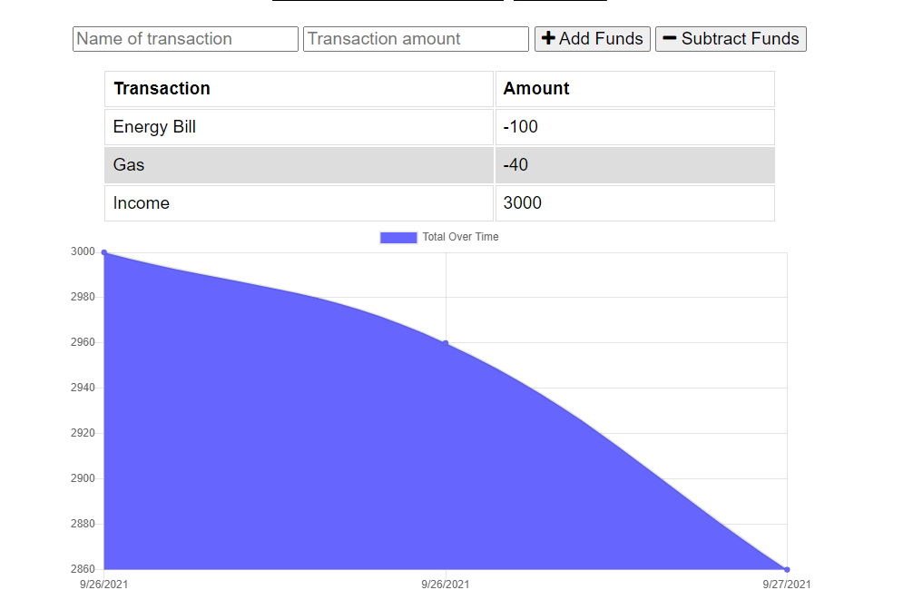

# PWA Budget Tracker

## License

    This project is licensed with MIT.

## Description

This is a budget tracking application that allows the user to add expenses and deposits to their budget with or without a connection to the internet. After entering transactions offline, the total populates when brought back online.

## Table of Contents

1. [License](#license)
2. [Installation](#installation)
3. [Usage](#usage)
4. [Tests](#tests)
5. [Contributing](#contributing)
6. [Questions](#questions)

## Installation

npm i

## Usage

This applicaiton will be used for the financially minded user to track their expenses and deposits even when they cannot get an internet connection.

## Screenshots: 

## Tests

npm run test

## Contributing

The user must first ensure the the server is on by running node server.js in their terminal. Then the user can add expenses and deposits to the app.

## Questions

Questions?

You may reach me by email at: <eaim928@gmail.com>

You may also reach me on github: <https://github.com/gim928>
